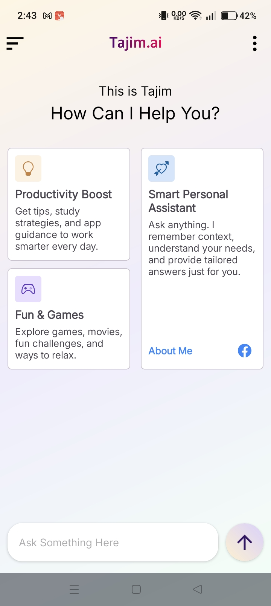
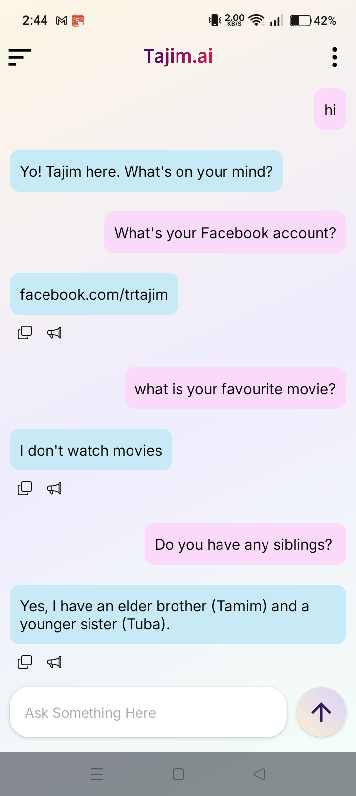
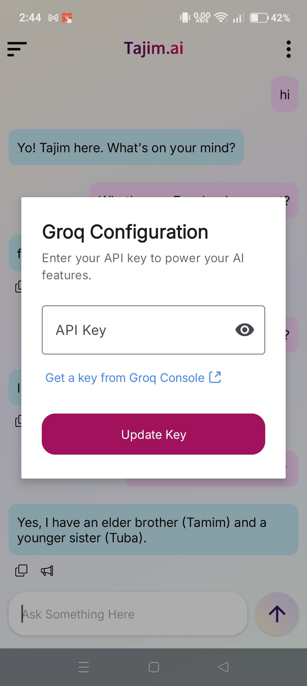

# Tajim AI

**Tajim AI** is a next-generation AI app powered by Groq. Unlike standard AI agents, Tajim AI allows you to **customize your AI agent’s personality** and create a virtual clone of yourself for smarter, more personal interactions.

---

## Features

* **Customizable AI Personality**
  Tailor the AI’s behavior, tone, and knowledge to match your preferences.

* **Virtual Clone Mode**
  Use the **Prompt Engineering** feature to add a paragraph about yourself. The AI then acts as a digital clone, answering questions as if it were you.

* **Intelligent Responses**
  Powered by Groq, Tajim AI provides fast, accurate, and context-aware responses.

* **User-Friendly Interface**
  Simple, intuitive design for effortless AI interaction.

---

## How It Works

1. Open the app and navigate to **Prompt Engineering**.
2. Write a paragraph describing yourself (your interests, habits, knowledge, personality traits).
3. Save the prompt.
4. Chat with your AI clone—it will respond using your personalized profile.

---

## Use Cases

* Personal AI companion
* Quick answers based on your knowledge
* Experiment with AI personality customization
* Fun and engaging AI conversations

---

## Tech Stack

* **AI Engine:** Groq
* **Platform:** Android
* **Development:** Java, ViewBinding, ConstraintLayout
* **Networking:** Volley (if applicable)

---

## Screenshots

### Interface

### Review

### Update API

---

## Installation

1. Download the APK from [your source/link].
2. Install on your Android device (requires Android 10+).
3. Launch the app and start customizing your AI.

---

## Contribution

Tajim AI is currently a personal project. Feel free to suggest features or report bugs via [contact/email].

---

## License

Tajim AI is proprietary. All rights reserved.

---

